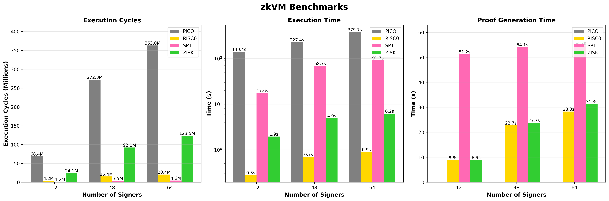

# Multi-zkvm signature benchmark

A benchmarking framework for comparing zero-knowledge virtual machine (zkVM) implementations using Schnorr signature verification over secp256k1. It evaluates the performance of different zkVM implementations by running a standardized workload: verifying multiple Schnorr signatures against a Merkle-committed validator set.

Built on top of [ERE](https://github.com/eth-act/ere) — a unified zkVM interface and toolkit for proving across multiple zkVM backends.

### Supported zkVMs
| 		zkVM | 	Architecture	 | 	Prover Resource Type	 | precompiles supported | Version | Proof Type |
| 	:-----:	 | 	:-----:	 | 	:-----:	 | :-----:	 | :-----:	 | :-----:	 | 
| 	SP1	| 	RISC-V 32-bit	| 	GPU supported	 | Yes | v5.2.4 | Groth16 |
| 	RISC0	| 	RISC-V 32-bit	| 	GPU supported	 | Yes | v3.0.3 | Groth16 |
| 	Zisk	| 	RISC-V 64-bit	| 	GPU supported	 | Yes | v0.13.0 | Compressed |
| 	Pico	| 	RISC-V 32-bit (nightly)	| 	Only CPU	 | Yes | v1.2.0 | Compressed |

### What It Does
The guest program performs the following operations inside the zkVM:

1. **Merkle Root Verification:** Computes a Merkle root from validator keys for validator inclusion check.
2. **Signature Verification:** For each candidate, verifies the Schnorr signature (BIP-340 style) against the message
3. **Public Output:** Commits the root, message, and count of valid signatures as public values

#### Cryptographic Primitives

- **Hash Function:** Keccak256 (precompiles used)
- **Signature Scheme:** Schnorr signatures on secp256k1 (BIP-340 compatible)
- **Merkle Tree:** Binary tree with Keccak256 hash of (ax || ay) for leaf nodes

### Architecture
Crates in the ```multi-zkvm``` folder
- **```common```**: Shared types and encode decode logic used by both host and guest programs.
- **```guest```**: Core Schnorr verification and merkle inclusion circuit implemented in a zkVM-agnostic way.
- **```guest-<zkvm>```**: Per-zkVM guest wrappers that adapt the common guest logic to each zkVM's API and SDK.
- **```host```**: Dockerized execution and proving pipeline using ere-dockerized, no local SDK required.
- **```host-native```**: Native execution and GPU-accelerated proving, requires local SDK installations. Also, produce benchmarks.
- **```benchmark```**: Contains logic for visualizing results from ```benchmark_results.json``` produced during proof generation.

### Benchmarks
Benchmarks for different number of signers can be found at [`benchmark_results.json`](benchmark/benchmark_results.json)


#### Benchmark Environment Specs
| Component | Specification |
|-----------|---------------|
| CPU | AMD EPYC 7742 64-Core (122 vCPUs) |
| Architecture | x86_64 |
| RAM | 49 GB |
| Swap|  ~95 GiB total|
| GPU | NVIDIA RTX 4090 (24 GB VRAM) |
| CUDA | 13.0 |

> [!NOTE]
> Pico was running into OOM issues even with high amounts of RAM, which is why it's missing the proof generation time.

### Prerequisites
#### For Dockerized Execution (host)

- Docker installed and running
- Rust installed (current minimum supported rust version is 1.88)
- Uses ere-dockerized for containerized compilation and proving

#### For Native/GPU Execution (host-native)

- Requires GPU with CUDA support. Ensure you have the appropriate NVIDIA drivers and CUDA toolkit installed
  
Install the required zkVM SDK by cloning the ere repository:

```
git clone https://github.com/eth-act/ere.git
cd ere
bash scripts/sdk_installers/install_sp1_sdk.sh    # For SP1
bash scripts/sdk_installers/install_risc0_sdk.sh  # For RISC0
bash scripts/sdk_installers/install_zisk_sdk.sh   # For Zisk
bash scripts/sdk_installers/install_pico_sdk.sh   # For Pico

```
> [!WARNING]
> SDK installations are often non-trivial. CUDA version mismatches, SDK compatibility issues, and undocumented errors are common.
>
> For correct installation, refer to the official documentation:
> - [SP1](https://docs.succinct.xyz)
> - [RISC0](https://dev.risczero.com)
> - [Pico](https://pico-docs.brevis.network/getting-started/installation)
> - [Zisk](https://0xpolygonhermez.github.io/zisk/introduction.html)
>
> If you encounter installation errors, consider using ChatGPT or Claude to help diagnose and resolve them, they can be effective at troubleshooting version conflicts and obscure build errors.

### Usage
All commands should be run from the ```/multi-zkvm``` directory.

#### Dockerized Execution (CPU)
Uses Docker containers for compilation and proving. No SDK installation required.
```
cargo run -p host -- \
  --zkvm sp1 \
  --msg "hello world" \
  --signers "$(seq -s ',' 0 47)"
```

#### Native Execution (GPU)
Requires the appropriate zkVM SDK toolkit to be installed. Supports GPU acceleration.

```
cargo run -p host-native -- \
  --zkvm sp1 \
  --msg "hello world" \
  --signers "$(seq -s ',' 0 47)"
```

#### Pico (Requires Nightly)
Pico requires a specific nightly Rust toolchain:

```
RUST_LOG=info cargo +nightly-2025-08-04 run -p host-native --no-default-features --features pico -- \
  --zkvm pico \
  --msg "hello world" \
  --signers "$(seq -s ',' 0 47)"
```

#### Command-Line Options

| Option | Description | Example |
|--------|-------------|---------|
| `--zkvm` | Target zkVM | `sp1`, `risc0`, `zisk`, `pico` |
| `--msg` | Message to sign | `"hello world"` or `0x<hex>` |
| `--signers` | Comma-separated signer indices (0-63)(max 63) | `"0,1,2,3"` or `"$(seq -s ',' 0 47)"` |


#### Output

The program outputs:

1. **Execution Phase**
   - Total cycles executed
   - Execution duration
   - Public values (root, message, valid signature count)

2. **Proving Phase**
   - Proving duration
   - Proof type (Groth16 for SP1/RISC0, Compressed for Pico/Zisk)
   - Final public values
  
### Benchmark Results

When using `host-native`, results are saved to `benchmark/benchmark_results.json`:

```json
{
  "results": [
    {
      "zkvm": "sp1",
      "num_signers": 48,
      "execution_cycles": 12345678,
      "execution_duration": 1.23,
      "proving_duration": 45.67,
      "timestamp": "2025-01-29T12:00:00Z"
    }
  ]
}
```
Results can be plotted by running `plot_benchmarks.py`:
```bash
cd benchmark
python -m venv venv
source venv/bin/activate
pip3 install -r requirements.txt
python3 plot_benchmarks.py
```
